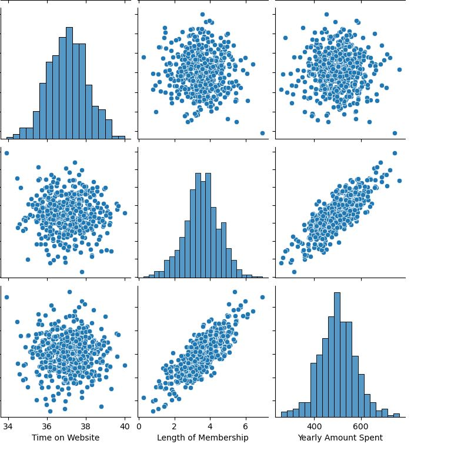

## Portfolio

---

## Data Analysis

### Strategy for NY E-commerce Company

I performed some EDA analysis to better understand the relationship between the variables and yearly amount  spent by customers.  Using a simple regression model I tried to predict using some test data. My model had Mean Absolute Error (MAE) of 7.2. It was seen that length of membership was strongly correlated to the yearly amount spent 
 
  

 

---
[Project 2 Title](/pdf/sample_presentation.pdf)

---
[Project 3 Title](http://example.com/)

---

### Category Name 2

- [Project 1 Title](http://example.com/)
- [Project 2 Title](http://example.com/)
- [Project 3 Title](http://example.com/)
- [Project 4 Title](http://example.com/)
- [Project 5 Title](http://example.com/)

---

